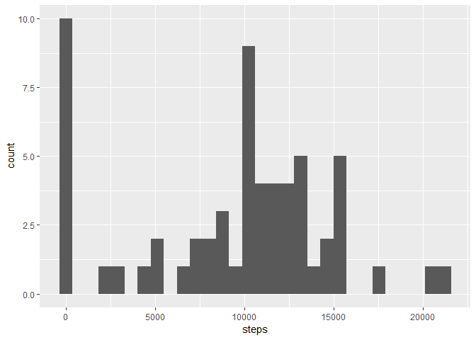
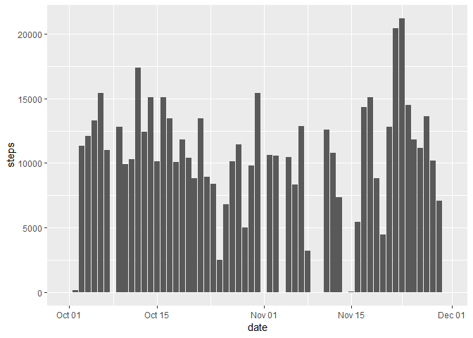
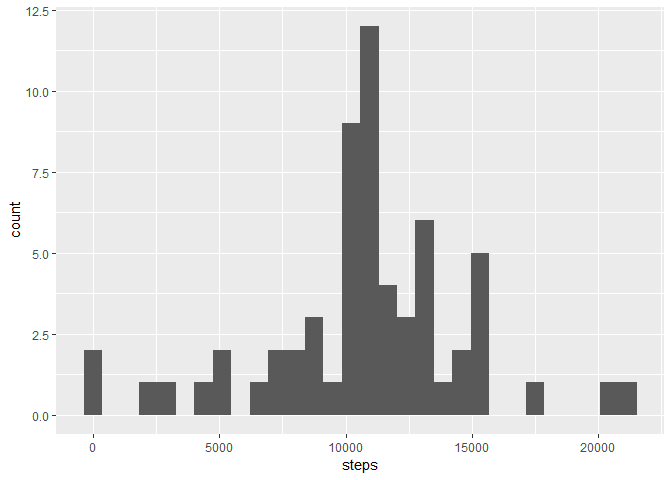
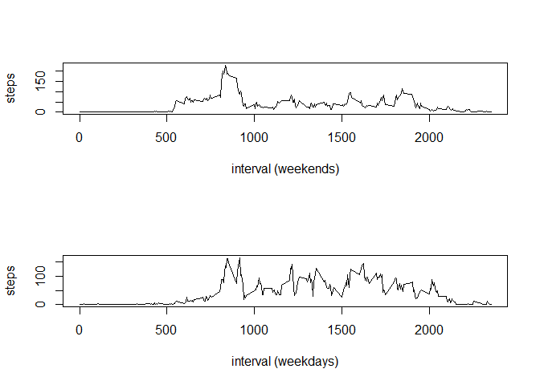

## Loading and preprocessing the data


```r
download.file('https://d396qusza40orc.cloudfront.net/repdata%2Fdata%2Factivity.zip', 'src.zip')
unzip('src.zip')
activity <- read_csv('activity.csv', col_types = 'iDi')
```


## What is mean total number of steps taken per day?

Here's the histogram of the number of steps each day.


```r
activity %>% group_by(date) %>% summarize(steps = sum(steps, na.rm = TRUE)) %>% ggplot(aes(x = steps)) + geom_histogram(bins = 30)
```

<!-- -->

And here is also a complimentary bar plot


```r
activity %>% group_by(date) %>% summarize(steps = sum(steps, na.rm = TRUE)) %>% ggplot(aes(x = date, y = steps)) + geom_col()
```

<!-- -->

Now let's calculate the number of steps statistics


```r
summary(activity$steps)
```

```
##    Min. 1st Qu.  Median    Mean 3rd Qu.    Max.    NA's 
##    0.00    0.00    0.00   37.38   12.00  806.00    2304
```

Mean is 37.38, median is 0


## What is the average daily activity pattern?


```r
p2 <- activity %>% group_by(interval) %>% summarize(steps = mean(steps, na.rm = TRUE))
plot(p2$interval, p2$steps, type = 'l', xlab = 'interval', ylab = 'steps')
```

<!-- -->

The 5-minute interval, on average across all the days in the dataset, that the maximum number of steps, is the 835-minutes interval:


```r
p2$interval[which(p2$steps == max(p2$steps))]
```

```
## [1] 835
```

## Imputing missing values

The total number of rows with missing values in the dataset is:

```r
sum(1 - complete.cases(activity))
```

```
## [1] 2304
```

To fill in the missing data we take the mean number of steps for each interval, removing the other rows


```r
imputed_activity <- activity %>% group_by(interval) %>% summarize(impute_steps = mean(steps, na.rm = TRUE)) %>% inner_join(activity, by = 'interval') %>% mutate(steps = ifelse(is.na(steps), impute_steps, steps)) %>% select(-impute_steps)
```

Here's the histogram of the number of steps each day for the imputed data.


```r
imputed_activity %>% group_by(date) %>% summarize(steps = sum(steps, na.rm = TRUE)) %>% ggplot(aes(x = steps)) + geom_histogram(bins = 30)
```

<!-- -->

And number of steps statistics


```r
summary(imputed_activity$steps)
```

```
##    Min. 1st Qu.  Median    Mean 3rd Qu.    Max. 
##    0.00    0.00    0.00   37.38   27.00  806.00
```

Mean is 37.38, median is 0, same as for the original data set, because we imputed in a smart way.

Obviously the total number of steps is higher, but since days are missing as a whole, numbers do not differ for days where we have data.


```r
sum(activity$steps, na.rm = TRUE)
```

```
## [1] 570608
```

```r
sum(imputed_activity$steps)
```

```
## [1] 656737.5
```


## Are there differences in activity patterns between weekdays and weekends?

Add first a new factor column for day type


```r
imputed_activity <- imputed_activity %>% mutate(daytype = factor(ifelse(!(weekdays(date) %in% c('Saturday', 'Sunday')), 'weekday', 'weekend')))
```

Now plot as required

```r
par(mfrow = c(2,1))
weekday_plot <- imputed_activity %>% filter(daytype == 'weekday') %>% group_by(interval) %>% summarize(steps = mean(steps))
plot(weekday_plot$interval, weekday_plot$steps, type = 'l', xlab = 'interval (weekends)', ylab = 'steps')
weekend_plot <- imputed_activity %>% filter(daytype == 'weekend') %>% group_by(interval) %>% summarize(steps = mean(steps))
plot(weekend_plot$interval, weekend_plot$steps, type = 'l', xlab = 'interval (weekdays)', ylab = 'steps')
```

<!-- -->
